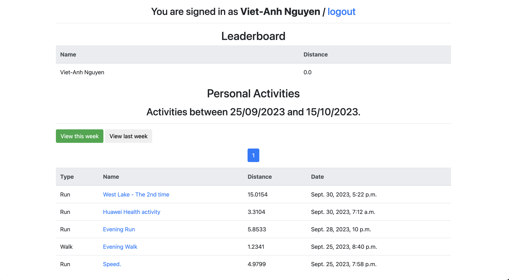

# TuringFit

TuringFit ([turingfit.com](https://turingfit.com)) is a Strava weekly ranking app for sport challenges.



**Features:**

- Query Strava API to get weekly activities
- Weekly ranking of activities ("Run", "Walk")

**TODO:**

- [ ] Docker-based deployment

**Environment Variables:**

The following variables that are given to you when you create an application on **strava.com**.

* `STRAVA_SECRET`
* `STRAVA_KEY`

Create a Django secret key and set it as an environment variable.

* `SECRET_KEY`

## 1. Environment Setup

- Python 3.8 or higher with Pip

```shell
pip install -r requirements.txt
```

## 2. Run Developement Server

```shell
python manage.py migrate
python manage.py runserver 0.0.0.0:8000
```

## 3. Run Worker (for Strava sync)

```shell
python manage.py runworkers
```
